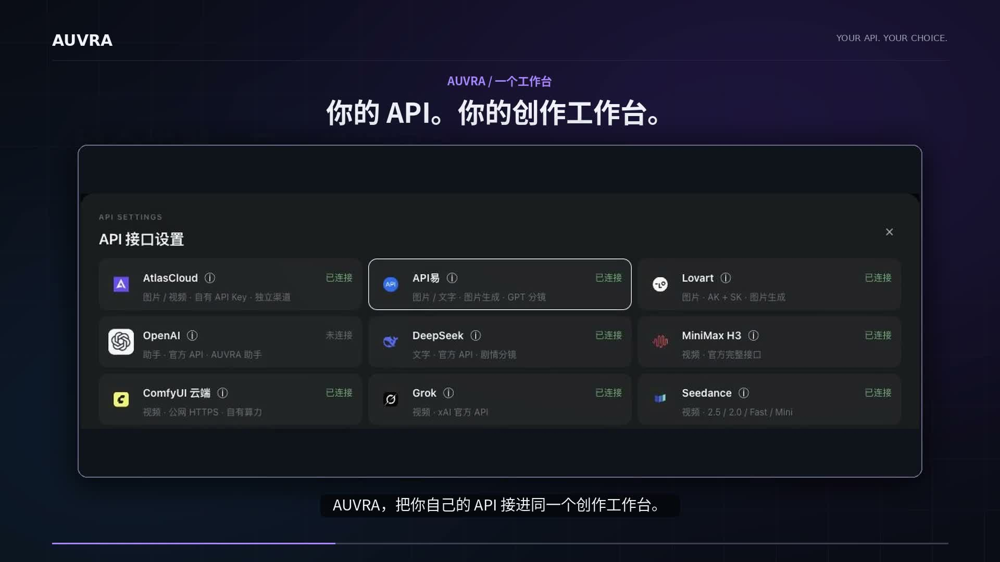

# AUVRA

**Your APIs. Your creative workspace.**

Bring images, video, audio and references into one creative canvas. Choose your models and providers, connect your own API accounts or remote ComfyUI, and keep your creative work in one place.

**[Visit AUVRA](https://auvra.art/) · [中文介绍](../README.md)**

## Watch the introduction

[Watch / download the 38-second introduction](https://github.com/zakkaart88-debug/auvra-showcase/raw/refs/heads/main/assets/auvra-overview-zh.mp4)

## What you can explore

- Image, video and audio models across supported providers.
- Your own API accounts and remote ComfyUI instance.
- A canvas for references, creative descriptions and generated media.
- Supported first-frame, first/last-frame and reference-based video modes.
- Camera exploration, subsequent shots and video frame capture.
- Experimental 3D previs references for camera and spatial exploration.

Available features and pricing vary by model and provider. Experimental features do not guarantee exact geometry or camera reproduction. Generation charges are determined by your selected provider. The website and introduction video currently use Chinese; this English overview does not imply an English-language product interface.

## Get started

Visit the website, create an account, connect a supported provider, and create your first project. There is no application source to install from this repository.

## Feedback

Use [Issues](https://github.com/zakkaart88-debug/auvra-showcase/issues) for product feedback. Never post API keys, passwords, private media or account details.

This is a product showcase and documentation repository, **not an open-source release**. It contains no application source, internal workflows, prompt recipes or deployment materials.
