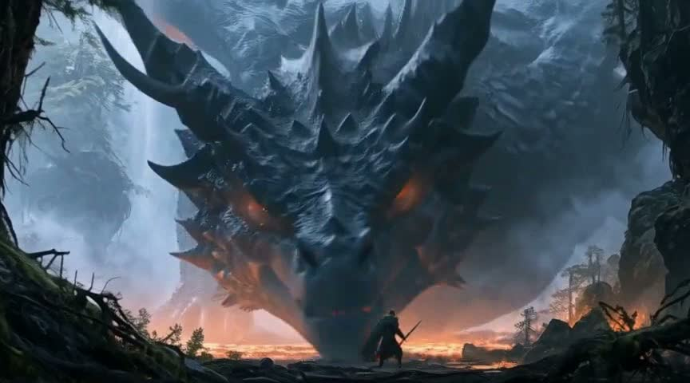

# 实验作品展示

[中文介绍](../README.md) · [English gallery](examples.en.md)

以下来自我们已有的创作实验，只展示输入画面与输出效果。不是内部测试报告，也不提供工作流、提示词或实现细节。

## 相机球：一张图，不同机位

| 原始画面 | 侧面机位探索 | 高机位探索 |
| --- | --- | --- |
|  |  |  |

同一张参考图探索不同取景。主体和场景会随视角重新生成，未见区域由模型推测；示例不表示所有几何细节都已准确重建。

## Blender 白模 → MiniMax H3 视频

[播放 / 下载 8 秒对比](../assets/previs-comparison.mp4)

上半屏：简单几何人物与场景的 Blender 预演。下半屏：以本地 MiniMax H3 生成的古装武侠实验。镜头与站位用于参考，动作和画面由模型生成；可以直接看到偏差，不以“精确复刻”宣传。

## 人脸修复：保留原片，对照选用

[播放 / 下载 8 秒对比](../assets/face-comparison.mp4)

上半屏为修复前，下半屏为修复后。它展示已有实验中的脸部处理，不代表最新默认设置的统一效果；清晰度、身份、动作和稳定性需一起检查。修复幅度可能很细微，不把修复描述为必然消除抖动或错位。

两条实验对比均为无声展示，重点是观察画面。宣传介绍及独立创作短片仍保留原有声音。

## 创作短片

[观看 5 秒创作样例](../assets/creative-example.mp4)

## 公开范围

仅公开已挑选的输出画面和产品说明。不发布实验原始记录、生成指令、节点图、模型配置、代码、账号资料或部署信息。
