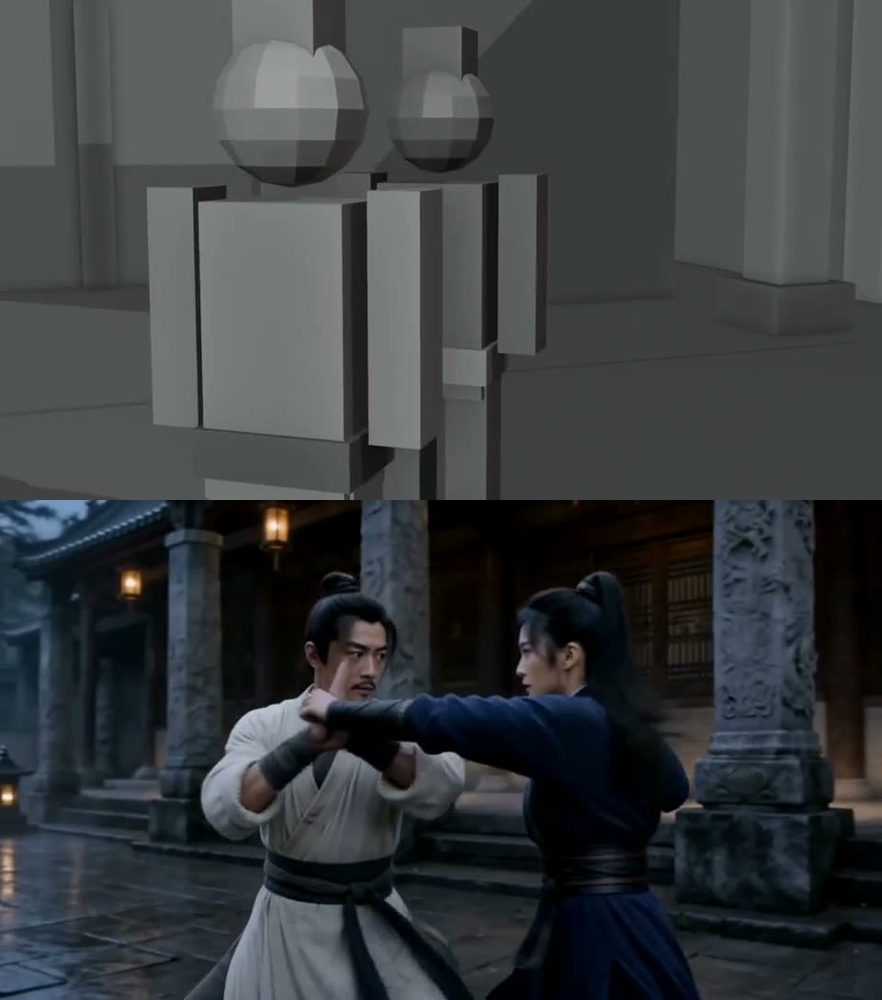
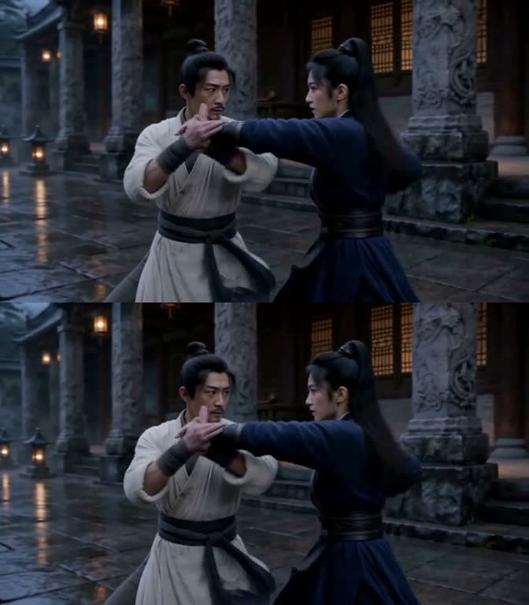
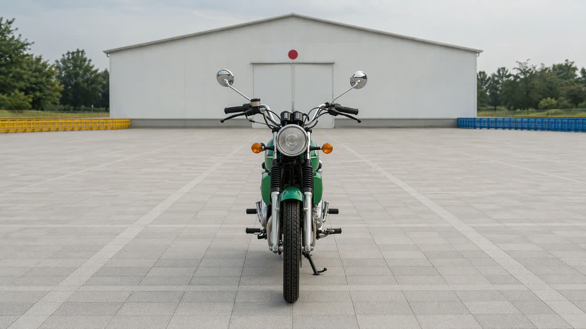
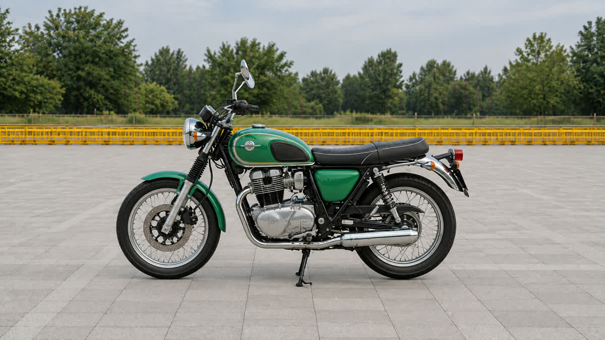
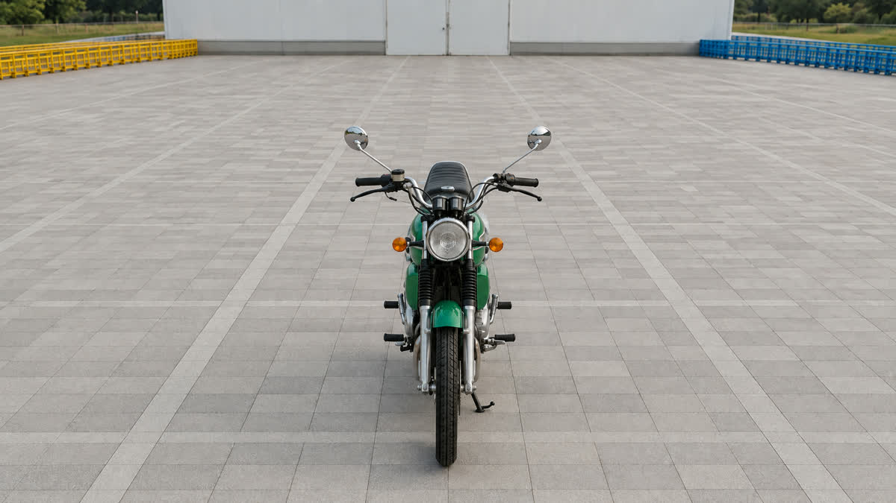

# AUVRA

### 你的 API，你的影像创作工作台。

从一张设定图，到镜头探索、白模预演、视频生成与人脸修复，把图片、视频、音频和参考素材放进同一张创作画布。连接自己的 API 或远程 ComfyUI，选择适合这一镜的模型，让不同服务的素材接着用。

**[打开 AUVRA](https://auvra.art/) · [English details](features.en.md) · [快速开始](quick-start.md) · [实验作品](examples.md) · [功能与更新](updates.md)**

## 38 秒认识 AUVRA

[播放 / 下载中文介绍视频 · 1080P · 38 秒](https://github.com/zakkaart88-debug/auvra-showcase/raw/refs/heads/main/assets/auvra-overview-zh.mp4)

## 工作台里有什么

### 创作画布：让素材与镜头接起来

把角色图、场景图、视频、声音和生成节点放在同一项目里，通过连线组织参考。提示描述中可以引用素材；参考图片支持悬停预览，方便确认选的是哪一张。生成结果继续留在画布中，可接到后续镜头，减少跨平台下载、上传和重新整理素材的操作。

### ComfyUI 工作流：用自己的 GPU 生成

AUVRA 提供基于 **MiniMax H3 本地模型**的 ComfyUI 视频生成工作流，连接用户自己的远程 ComfyUI 实例，在网站画布里提交与查看结果。参考图、参考视频和声音可按所选模式参与创作；提供快速预览与高质量选择，并可查看、复制实际使用的种子。

这是使用自有算力的创作路线，不必每一镜都调用云端视频 API。实例需具备相应模型和依赖；生成速度与可用分辨率受 GPU、模型和工作流支持范围影响。相同种子还需要相同输入和设置，不能保证跨分辨率生成完全相同的画面。

### 人脸修复：生成之后，再检查细节

ComfyUI 视频路线支持 AUVRA 的**人脸修复 / 精修**，改善生成片段中的脸部细节，尤其方便检查多人、运动与远景素材。支持关闭或调整增强程度，**原片与修复版分别保留**，方便比较和选择。

修脸是增强工具，不是“永不崩脸”的保证。极小脸、遮挡、身份一致性、抖动和对白口型仍需逐镜检查。

### 相机球：从一张图探索不同机位

通过相机球调整视角、俯仰和远近，探索侧面、俯视、反向机位与不同景别；结果可继续作为分镜或视频的图片参考。空间环绕用于探索围绕场景的视角，并选取所需画面。

适合角色、产品和场景的镜头方案试拍。单张图片没有完整三维信息，模型需要推测看不见的空间，因此它是**AI 机位探索**，不是精确三维重建；大角度变化仍可能出现空间或外观偏差。

### 白模预演：先定空间与运镜，再探索成片

**基于 MiniMax H3 本地模型的实验性功能。** 在 Blender 中用简单几何体搭场景、放人物、安排镜头，再将白模预演作为视频参考，配合角色图、场景图和声音，在 AUVRA 中生成视频。

白模表达镜头运动、人物位置与空间关系；图片提供内容和视觉样式；动作表现由描述与模型生成，不必先把人物肢体动画做完。我们已探索人物走动、追逐、武侠打斗、跟随、推摇与反打等镜头，并制作预演与结果的上下对照。

目前适合分镜探索和粗预演引导，**不保证逐帧复刻走位、几何关系或镜头轨迹**。复杂镜头需要对照结果、调整素材并筛选；声音接入也不等于对白口型必然准确。

### 截帧、下一镜与画质提升

- **视频截帧**：生成视频和上传的视频素材，可截取首帧、尾帧或当前帧，创建连线图片节点，接着创作。
- **下一镜 / 单镜头推演**：以已有画面继续探索镜头与叙事，减少从零重建素材的步骤。
- **画质提升**：提供 AuvrA · 免费增强与 AtlasCloud 云端增强；云端路线使用用户绑定的 AtlasCloud，确认费用后提交，原片保留。放大分辨率不代表恢复原本不存在的细节。

## 看实际实验作品

**白模预演 → H3 视频**：上半屏为 Blender 预演，下半屏为生成结果。

[观看 8 秒上下对比](https://github.com/zakkaart88-debug/auvra-showcase/raw/refs/heads/main/assets/previs-comparison.mp4)

**人脸修复前后**：上半屏为原片，下半屏为修复版，可对照查看运动中的脸部细节。

[观看 8 秒修复对比](https://github.com/zakkaart88-debug/auvra-showcase/raw/refs/heads/main/assets/face-comparison.mp4)

**相机球多机位**：原始画面、侧面探索与高机位探索。

| 原始画面 | 侧面机位 | 高机位 |
| --- | --- | --- |
|  |  |  |

[完整实验作品说明](examples.md)

这些是已有实验输出，不是每次生成的效果承诺。公开内容仅包含画面与使用说明，不包含内部工作流、提示词策略或实现代码。

## 自己选择模型与服务

支持的官方 API、API易、AtlasCloud 与自有 ComfyUI 在一个工作台中使用。按模型和渠道选择可用模式、尺寸、分辨率与高级设置，并查看价格信息。不同渠道的模型覆盖、能力、账单和素材处理政策可能不同。

我们支持并鼓励使用官方 API，也提供部分第三方渠道供用户自行选择。你可以按项目需要选择服务，不必把全部创作固定在一家平台的年卡里。生成费用由所选供应商收取，自有 GPU 的费用由算力服务方收取；连接账户不等于免费生成。

## 开始体验

1. 打开 [auvra.art](https://auvra.art/)，注册或登录。
2. 在「API 接口」连接自己的服务账户，或设置具备所需模型与依赖的远程 ComfyUI。
3. 新建项目，把参考素材放进画布，选择模型，完成第一镜。

适合 AI 影像爱好者、分镜创作者、短片与 MV 创作团队。功能以网站当前可用选项为准。

## 反馈与合作

- 使用问题：[提交反馈](https://github.com/zakkaart88-debug/auvra-showcase/issues/new/choose)。请勿上传密钥、私人素材或账号信息。
- 合作咨询：在 [网站](https://auvra.art/) 的「反馈」中选择「合作咨询」。
- 关注更新：可以 Star 或 Watch 本仓库。

## 关于这个仓库

这是 AUVRA 的**产品展示与公开使用说明仓库**，不是开源软件项目。不包含网站源代码、内部工作流、提示词配方、接口实现或部署资料。使用产品请访问网站；产品及品牌使用以网站条款为准。

## 项目、声音与 AI 助手

项目资产库用于组织主体、参考素材与生成结果，并查看和管理个人存储。已接入豆包音频创作及视频音轨替换；声音可在所选模型支持的模式中作为参考，但口型仍需检查。

支持通过 MCP / Plugin 在兼容的 AI 客户端连接账户，使用已开放的项目和创作工具。具体支持范围取决于客户端和网站当前功能；提交生成前应明确模型、数量与预算。公开介绍不提供内部工具实现或提示词策略。
